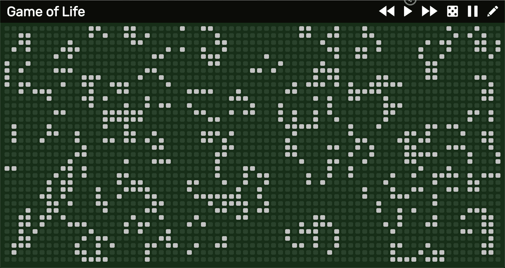

        

# Game of Life
Conveys Game of Life with a modern browser interface to play with.

##### First design draft

##### First implementation

**Note:** The speed looks a bit unstable but this is caused by the video capturing tool not the website itself.

## Feature ideas
- [X] Animate Cell state change
- [ ] Grid Layout controls (Cell Size, Cell Spacing)
- [ ] Advanced Grid State Controls (Stepping Backwards)
- [ ] Select Emojis as representatives for dead and alive cells
- [ ] Endless Grid ( [Spaceships](https://en.wikipedia.org/wiki/Spaceship_(cellular_automaton)) that leave the grid on the left come back in on the right side)
